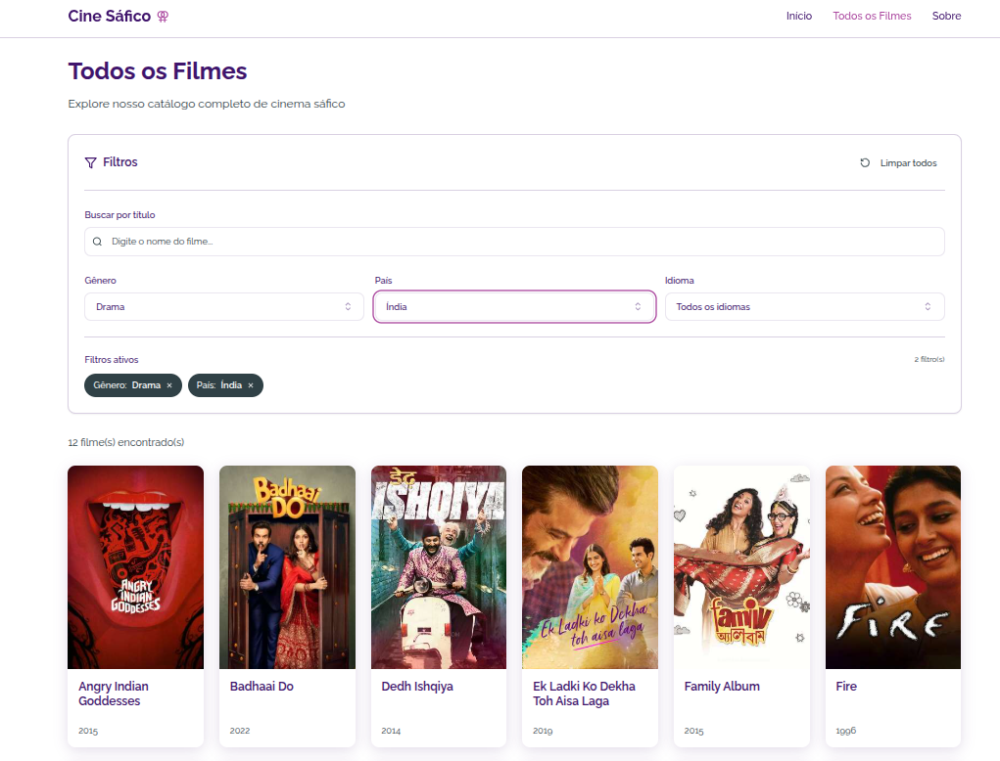

# CINE-SAFICO - Plataforma de Filmes LBT Femininos

CINE-SAFICO é uma aplicação web dedicada à promoção e celebração do cinema LBT feminino, com foco em histórias autênticas e representação genuína.



## 📋 Sumário
- [Visão Geral](#visão-geral)
- [Funcionalidades](#funcionalidades)
- [Tecnologias](#tecnologias)
- [Arquitetura](#arquitetura)
- [Instalação](#instalação)
- [Scripts Disponíveis](#scripts-disponíveis)
- [Navegação entre Páginas](#navegação-entre-páginas)
- [Deploy](#deploy)
- [API](#api)
- [Contribuição](#contribuição)

## Visão Geral

CINE-SAFICO é uma plataforma que permite aos usuários:
- Explorar filmes LBT femininos organizados por categorias
- Buscar filmes por título, gênero, país e idioma
- Ver detalhes completos de cada filme
- Navegar entre diferentes seções temáticas na página inicial

A aplicação foi projetada com uma experiência de navegação fluida, permitindo preservar filtros aplicados quando o usuário navega entre listas de filmes e detalhes individuais.

## ✨ Funcionalidades

### Home
- Seção de destaque com banner principal
- Carrosséis horizontais de filmes organizados por gênero
- Links rápidos para explorações por categoria

### Exploração de Filmes
- Lista paginada de todos os filmes
- Filtros por gênero, país e idioma
- Barra de pesquisa por título
- Badges de filtros ativos com opção de remoção
- Persistência de filtros na URL para compartilhamento

### Detalhes do Filme
- Informações detalhadas do filme (título, ano, sinopse, etc.)
- Informações técnicas (duração, país, idioma)
- Botão para voltar à lista anterior preservando filtros aplicados

### Autenticação
- Páginas de login e cadastro (em desenvolvimento)

## 🛠️ Tecnologias

O projeto utiliza um stack moderno de tecnologias:

- **React** (v18): Biblioteca principal para construção da interface
- **TypeScript**: Tipagem estática para melhor desenvolvimento
- **Vite**: Ferramenta de build e desenvolvimento com hot reload
- **React Router DOM** (v6): Gerenciamento de rotas
- **Axios**: Cliente HTTP para comunicação com a API
- **TanStack Query**: Gerenciamento de estado e caching para requisições
- **Shadcn UI**: Biblioteca de componentes de interface
- **Tailwind CSS**: Framework de CSS utilitário
- **Lucide React**: Ícones
- **Zod + React Hook Form**: Validação de formulários

## 🏗️ Arquitetura

O projeto segue uma arquitetura organizada:

```
src/
  ├── components/        # Componentes reutilizáveis
  │    ├── shared/       # Componentes específicos da aplicação
  │    └── ui/           # Componentes de UI genéricos (shadcn)
  ├── hooks/             # Hooks personalizados
  ├── lib/               # Utilitários e funções auxiliares
  ├── mocks/             # Dados simulados para desenvolvimento
  ├── pages/             # Componentes de página
  └── shared/            # Código compartilhado
       ├── api/          # Clientes de API e funções de requisição
       └── interfaces/   # Interfaces TypeScript
```

## 🚀 Instalação

### Pré-requisitos
- Node.js
- npm

### Passos para instalação

```bash
# Clone o repositório
git clone <url-do-repositorio>

# Entre no diretório
cd cine-safico-front

# Instale as dependências
npm install

# Inicie o servidor de desenvolvimento
npm run dev
```

## 📜 Scripts Disponíveis

- `npm run dev` - Inicia o servidor de desenvolvimento
- `npm run build` - Compila o projeto para produção
- `npm run build:dev` - Compila o projeto com configurações de desenvolvimento
- `npm run lint` - Executa o linter para verificar problemas de código
- `npm run preview` - Visualiza a build de produção localmente

## 🧭 Navegação entre Páginas

A aplicação implementa um sistema de navegação SPA (Single Page Application) avançado com preservação de estado entre rotas:

### Principais Fluxos de Navegação

1. **Home → Lista de Filmes**:  
   Navegação simples sem estado

2. **Home → Lista de Filmes com Filtro por Gênero**:  
   Navegação com filtro pré-aplicado baseado na seção clicada

3. **Lista de Filmes → Detalhes do Filme**:  
   Preserva os filtros aplicados, permitindo voltar exatamente para a mesma visualização

4. **Detalhes do Filme → Lista de Filmes**:  
   Botão "Voltar" inteligente que retorna à lista anterior com os mesmos filtros

### Implementação Técnica

- Uso do estado de navegação do React Router para preservar filtros entre rotas
- Sincronização bidirecional entre filtros e URL para permitir navegação direta e compartilhamento
- Componente `MovieCardWithState` que encapsula o estado de navegação


## 🌐 Deploy

O projeto está configurado para deploy no Vercel com suporte completo a SPA:

### Configuração do Vercel

O arquivo `vercel.json` contém as configurações necessárias para o funcionamento correto da aplicação em produção. 
Esta configuração garante que todas as rotas sejam redirecionadas para o `index.html`, permitindo que o React Router assuma o controle da navegação do lado do cliente.

## 🔌 API

A aplicação consome dados da API CINE-SAFICO:

- **Base URL**: `https://cine-safico.onrender.com`
- **Endpoints principais**:
  - `/highlights`: Filmes em destaque para a página inicial
  - `/genres-sections`: Seções de filmes por gênero para a página inicial
  - `/movies`: Lista paginada de todos os filmes (suporta filtros)
  - `/movie/:slug`: Detalhes completos de um filme específico
  - `/genres`: Lista de todos os gêneros disponíveis
  - `/countries`: Lista de todos os países disponíveis
  - `/languages`: Lista de todos os idiomas disponíveis

---

Criado com 💜 para a comunidade LBT | [Website](https://cine-safico-front.vercel.app/)